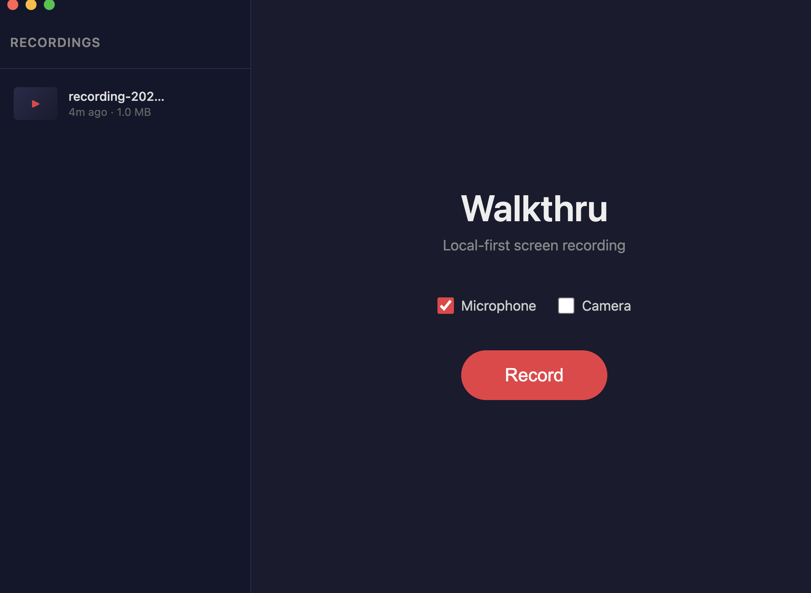
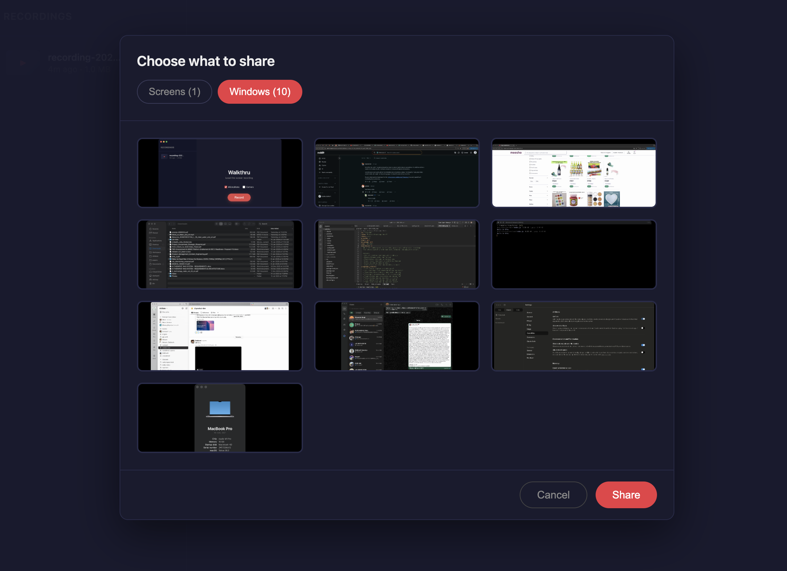
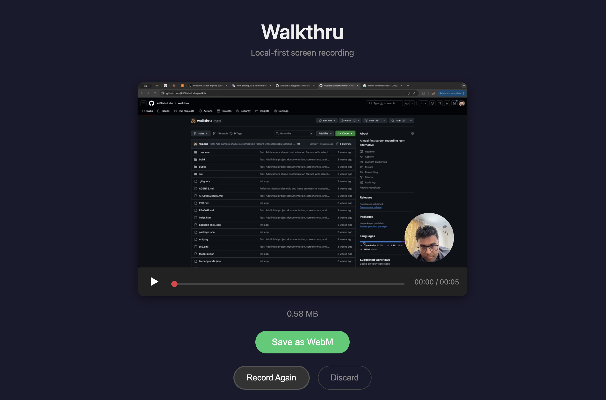
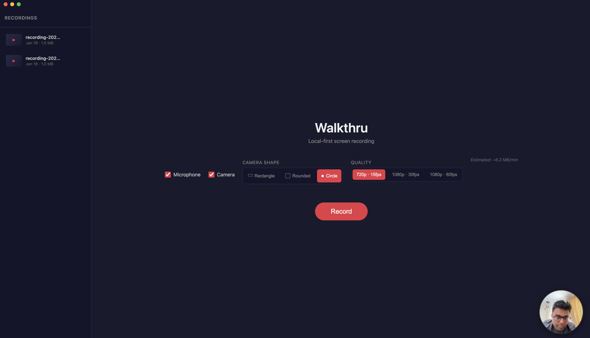

# Walkthru

> **Local-first Loom replacement: camera + screen recorder built for privacy and speed.**

Walkthru is a lightweight, privacy-focused Loom replacement built with Electron and React. It combines screen recording and face camera recording in one app, saves everything locally to your machine (`~/Movies/Walkthru`), and works completely offline.

## Screenshots

<div align="center">
  
  
  
  
</div>

## Features

- **🎥 Screen & Window Recording**: Choose to record your entire screen or specific application windows.
- **🙂 Face Recording**: Record your face camera alongside your screen with a PiP-style overlay.
- **🔒 Privacy First**: All data stays on your local device. No cloud uploads.
- **🎙️ Audio Capture**: Record system audio and microphone input.
- **📂 File Management**: Built-in gallery to view, export, and delete recordings.
- **⚡ Fast & Native**: Built with Electron for native performance.

## Tech Stack

- **Frontend**: React, TypeScript, Vite
- **Shell**: Electron
- **Styling**: Vanilla CSS (Dark Mode optimized)
- **Build Tool**: Electron Builder

## Getting Started

### Prerequisites

- Node.js (v18 or higher recommended)
- npm or yarn

### Installation

1. Clone the repository:
   ```bash
   git clone https://github.com/AltSlate-Labs/walkthru.git
   cd walkthru
   ```

2. Install dependencies:
   ```bash
   npm install
   ```

3. Run in development mode:
   ```bash
   npm run dev
   ```

### Building for Production

To create a distributable application (DMG for macOS, NSIS for Windows):

```bash
npm run build
```

The output will be in the `release/` directory.

## License

MIT
